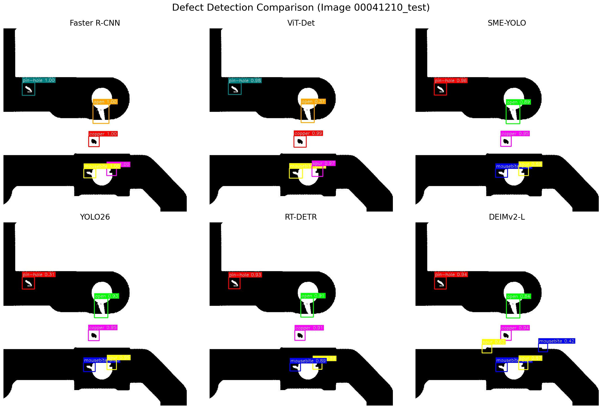
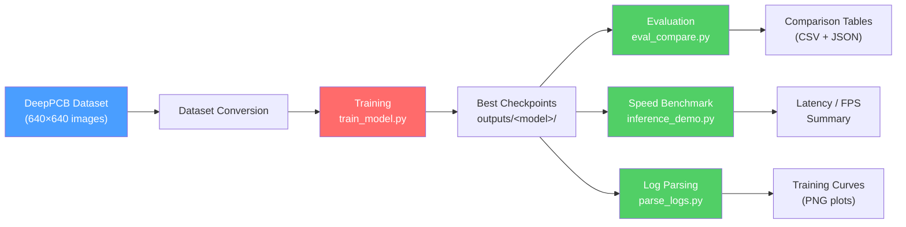
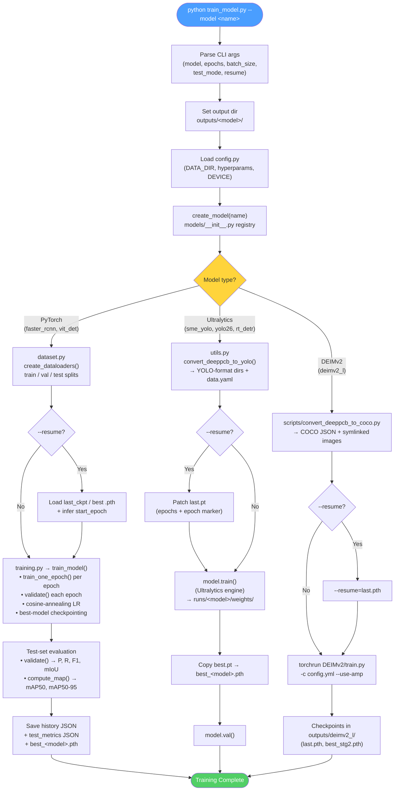
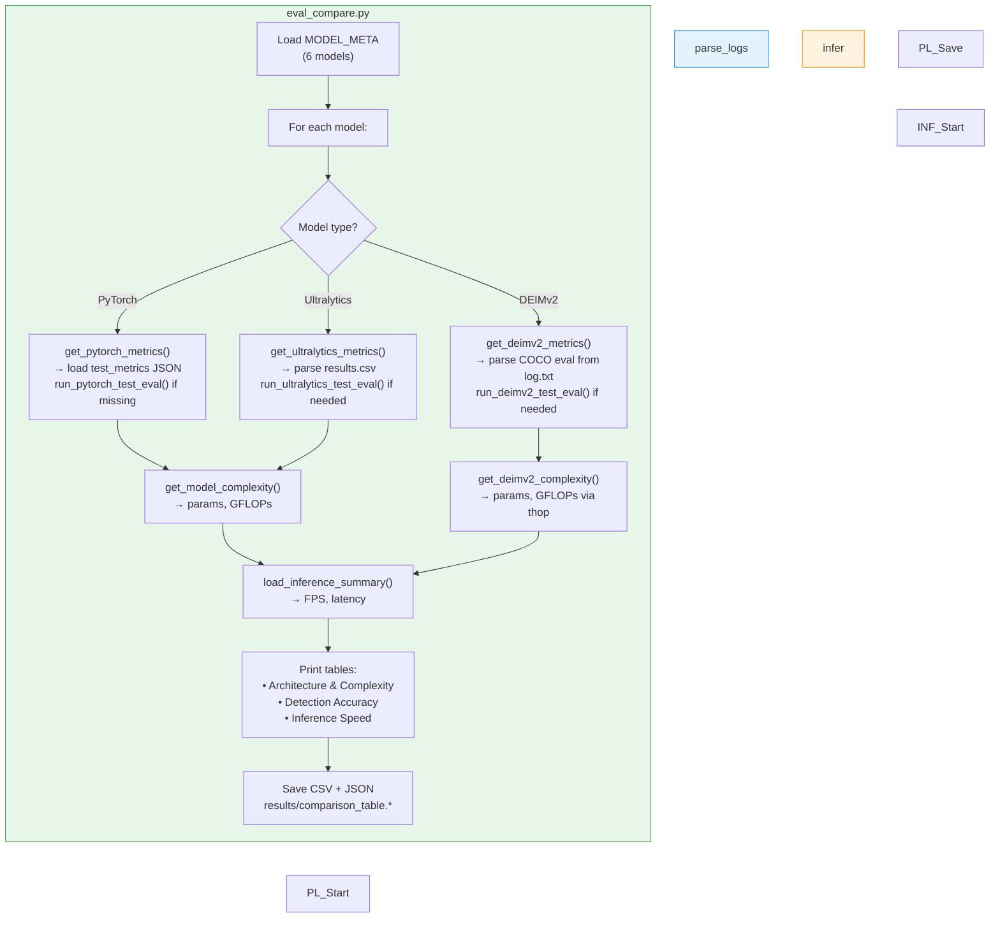

# PCB Wafer Defect Detection

A research pipeline for PCB (Printed Circuit Board) defect detection,
comparing multiple deep-learning model architectures on the
[DeepPCB](https://github.com/tangsanli5201/DeepPCB) dataset.

> **Report available**: For a comprehensive analysis, performance breakdown, and inference benchmarks, please refer to the detailed **[Model Comparison Report](REPORT.md)**.

---

## Supported Models

| ID | Model | Backbone | Training engine | Test mAP@0.5 | FPS | Reference |
|----|-------|----------|-----------------|--------------|-----|-----------|
| `faster_rcnn` | Faster R-CNN | ResNet-50-FPN v2 | PyTorch | 0.967 | 37.3 | Ren et al., NeurIPS 2015 |
| `vit_det` | ViT-Det | ViT-Base/16 + FPN | PyTorch | 0.805 | 28.7 | Li et al., ECCV 2022 |
| `sme_yolo` | SME-YOLO | YOLOv11n (CSPDarknet) | Ultralytics | 0.967 | 93.6 | arXiv:2601.11402 |
| `yolo26` | YOLO26 | YOLO26n | Ultralytics | 0.927 | 89.7 | Ultralytics docs |
| `rt_detr` | RT-DETR-L | ResNet-based | Ultralytics | 0.975 | 27.1 | Zhao et al., CVPR 2024 |
| `deimv2_l` | **DEIMv2-L** | **DINOv3-S** | DEIMv2 / torchrun | 0.973 | 19.9 | Huang et al., 2025 |

### Inference Demo

Below is an actual cross-model inference comparison on the test set:


---

## Dataset — DeepPCB

Located at `DeepPCB/PCBData/`. Six defect classes:

| ID | 1 | 2 | 3 | 4 | 5 | 6 |
|----|---|---|---|---|---|---|
| **Name** | open | short | mousebite | spur | copper | pin-hole |

Images are 640 × 640 px. Annotations are per-image `.txt` files in
`x1,y1,x2,y2,type` format. See [`DeepPCB/README.md`](DeepPCB/README.md).

---

## External Dependencies that required manual installation

### `DEIMv2/`
Real-time object detection framework using DINOv3 features.

```bash
git clone https://github.com/Intellindust-AI-Lab/DEIMv2.git DEIMv2
cd DEIMv2
pip install -r requirements.txt
```

See [`DEIMv2/README.md`](DEIMv2/README.md) for full documentation,
model zoo, and deployment guides.

### `dinov3/`
Facebook Research's DINOv3 vision foundation model.

```bash
git clone https://github.com/facebookresearch/dinov3.git dinov3
```

Download the pretrained backbone weights and place them at:
```
dinov3/pretrained_weight/
├── dinov3_vits16_pretrain_lvd1689m-08c60483.pth    # DINOv3-S  → used by DEIMv2-L
└── dinov3_vits16plus_pretrain_lvd1689m-4057cbaa.pth # DINOv3-S+ → used by DEIMv2-X
```

The training scripts automatically symlink these into `DEIMv2/ckpts/`  
when you first run a DEIMv2 model.

---

## Quickstart

### 1. Install dependencies

```bash
conda activate pcb
bash scripts/install_deps.sh
```

For DEIMv2, additionally:

```bash
cd DEIMv2 && pip install -r requirements.txt && cd ..
```

### 2. (Optional) Pre-convert DeepPCB to COCO format

DEIMv2 models need COCO-format JSON annotations. This is done **automatically**
on the first training run, but you can also run it manually:

```bash
python scripts/convert_deeppcb_to_coco.py \
    --deeppcb_dir DeepPCB/PCBData \
    --output_dir  data/deeppcb_coco \
    --val_ratio   0.15 \
    --seed        42
```

### 3. Train a single model

```bash
# Standard PyTorch / Ultralytics models
python train_model.py --model vit_det --epochs 20

# DEIMv2-L (DINOv3-S backbone, ~32M params)
python train_model.py --model deimv2_l

# Quick smoke-test (1 epoch)
python train_model.py --model deimv2_l --test_mode
```

### 4. Train all models sequentially

```bash
bash scripts/run_all_models.sh           # all models, full run
bash scripts/run_all_models.sh --test    # test mode (1 epoch each)
bash scripts/run_all_models.sh deimv2_l  # single model
```

### 5. Evaluate and compare

```bash
python eval_compare.py      # generate comparison table
python parse_logs.py        # parse training logs & plot curves
python inference_demo.py    # speed benchmark
```

---

## Code Flowcharts

### Overall Pipeline



### Training Pipeline  (`train_model.py`)



### Evaluation & Reporting Pipeline



---

## Directory Structure

```
PCB_wafer_defect_detection/
├── models/                          ← model definitions
│   ├── __init__.py                  ← model registry (6 models)
│   ├── faster_rcnn.py / vit_det.py  ← PyTorch-loop models
│   ├── sme_yolo.py / yolo26.py / rt_detr.py  ← Ultralytics
│   └── deimv2_l.py                  ← DEIMv2-L wrapper
├── scripts/                         ← shell scripts & utilities
│   ├── run_all_models.sh            ← sequential training orchestrator
│   ├── run_resume_50ep.sh           ← resume training to 50 epochs
│   ├── install_deps.sh              ← install dependencies
│   └── convert_deeppcb_to_coco.py   ← dataset conversion
├── train_model.py                   ← unified training entry-point
├── eval_compare.py                  ← evaluation & comparison tables
├── inference_demo.py                ← speed benchmarks
├── parse_logs.py                    ← log parsing & plots
├── config.py / dataset.py / training.py / evaluation.py / utils.py
├── REPORT.md                        ← final results report
├── DEIMv2/                          ← external repo (not in git)
├── dinov3/                          ← external repo (not in git)
├── DeepPCB/                         ← dataset (in DeepPCB project located within https://github.com/tangsanli5201/DeepPCB).
├── outputs/                         ← training outputs (not in git)
├── results/                         ← evaluation results (not in git)
└── _archive/                        ← old/unused files (not in git)
```

---

## References

This work have utlized below models and some of pretrain weight and tune on all paramters, please refer to the corresponding publications:

### DEIMv2 & DINOv3
```bibtex
@article{huang2025deimv2,
  title={Real-Time Object Detection Meets DINOv3},
  author={Huang, Shihua and Hou, Yongjie and Liu, Longfei and Yu, Xuanlong and Shen, Xi},
  journal={arXiv},
  year={2025}
}

@article{simeoni2025dinov3,
  title={DINOv3},
  author={Siméoni, Oriane and Vo, Huy V and Seitzer, Maximilian and others},
  journal={arXiv},
  year={2025}
}
```

### Faster R-CNN
```bibtex
@inproceedings{ren2015faster,
  title={Faster R-CNN: Towards Real-Time Object Detection with Region Proposal Networks},
  author={Ren, Shaoqing and He, Kaiming and Girshick, Ross and Sun, Jian},
  booktitle={Advances in Neural Information Processing Systems},
  volume={28},
  year={2015}
}
```

### ViT-Det
```bibtex
@inproceedings{li2022exploring,
  title={Exploring Plain Vision Transformer Backbones for Object Detection},
  author={Li, Yanghao and Mao, Hanzi and Girshick, Ross and He, Kaiming},
  booktitle={European Conference on Computer Vision (ECCV)},
  year={2022}
}
```

### SME-YOLO
```bibtex
@article{smeyolo2026,
  title={SME-YOLO: Small and Micro object Detection via CSPDarknet},
  journal={arXiv preprint arXiv:2601.11402},
  year={2026}
}
```

### RT-DETR
```bibtex
@inproceedings{zhao2024detrs,
  title={DETRs Beat YOLOs on Real-time Object Detection},
  author={Zhao, Yian and Lv, Wenyu and Xu, Shang and Wei, Jianwei and Wang, Guanzhong and Dang, Qingqing and Liu, Yi and Chen, Jie},
  booktitle={Proceedings of the IEEE/CVF Conference on Computer Vision and Pattern Recognition (CVPR)},
  year={2024}
}
```

### YOLO (Ultralytics)
```bibtex
@software{jocher2023ultralytics,
  title={Ultralytics YOLO},
  author={Jocher, Glenn and Chaurasia, Ayush and Qiu, Jing},
  year={2023},
  url={https://github.com/ultralytics/ultralytics}
}
```

