# PCB Defect Detection — Model Comparison Report

## 1. Introduction

This report compares **five** object detection models for **PCB (Printed Circuit Board) defect detection** on the **DeepPCB** dataset:

| Model | Type | Reference |
|---|---|---|
| **SME-YOLO** | One-stage (based on YOLOv11n) | arxiv 2601.11402 |
| **YOLO26** | One-stage (Ultralytics YOLO26n) | Ultralytics docs |
| **Faster R-CNN** | Two-stage (ResNet-50 FPN v2) | Ren et al., NeurIPS 2015 |
| **ViT-Det** | Two-stage (ViT-Base/16 + FPN) | Li et al., ECCV 2022 |
| **RT-DETR** | Transformer (end-to-end) | Zhao et al., CVPR 2024 |

### Dataset Summary

| Property | Value |
|---|---|
| Dataset | DeepPCB |
| Defect Classes | 6 (open, short, mousebite, spur, copper, pin-hole) |
| Training Images | {{TRAIN_IMAGES}} |
| Validation Images | {{VAL_IMAGES}} |
| Test Images | {{TEST_IMAGES}} |
| Image Size | 640 × 640 |

---

## 2. Hardware & Environment

| Property | Value |
|---|---|
| GPU | {{GPU_MODEL}} |
| GPU Memory | {{GPU_MEMORY}} |
| CPU | {{CPU_MODEL}} |
| RAM | {{RAM}} |
| OS | {{OS}} |
| Python | {{PYTHON_VERSION}} |
| PyTorch | {{PYTORCH_VERSION}} |
| Ultralytics | {{ULTRALYTICS_VERSION}} |
| CUDA | {{CUDA_VERSION}} |
| Batch Size | {{BATCH_SIZE}} |

---

## 3. Model Architecture Comparison

| Criteria | Faster R-CNN | SME-YOLO | YOLO26 | ViT-Det | RT-DETR |
|---|---|---|---|---|---|
| **Architecture** | Two-stage | One-stage | One-stage | Two-stage | Transformer |
| **Backbone** | ResNet-50 FPN v2 | YOLOv11n (CSPDarknet) | YOLO26n | ViT-Base/16 + FPN | RT-DETR-L |
| **Pretrained** | COCO | COCO | COCO | ImageNet | COCO |
| **Total Parameters** | {{FRCNN_PARAMS}} | {{SME_PARAMS}} | {{YOLO26_PARAMS}} | {{VITDET_PARAMS}} | {{RTDETR_PARAMS}} |
| **GFLOPs** | {{FRCNN_GFLOPS}} | {{SME_GFLOPS}} | {{YOLO26_GFLOPS}} | {{VITDET_GFLOPS}} | {{RTDETR_GFLOPS}} |
| **Weight File Size** | {{FRCNN_SIZE_MB}} MB | {{SME_SIZE_MB}} MB | {{YOLO26_SIZE_MB}} MB | {{VITDET_SIZE_MB}} MB | {{RTDETR_SIZE_MB}} MB |

---

## 4. Training Configuration

| Setting | Faster R-CNN | SME-YOLO | YOLO26 | ViT-Det | RT-DETR |
|---|---|---|---|---|---|
| **Framework** | PyTorch (manual loop) | Ultralytics | Ultralytics | PyTorch (manual loop) | Ultralytics |
| **Epochs** | {{FRCNN_EPOCHS}} | {{SME_EPOCHS}} | {{YOLO26_EPOCHS}} | {{VITDET_EPOCHS}} | {{RTDETR_EPOCHS}} |
| **Optimizer** | AdamW | Auto (AdamW) | Auto (AdamW) | AdamW | Auto (AdamW) |
| **Learning Rate** | {{FRCNN_LR}} | Auto | Auto | {{VITDET_LR}} | Auto |
| **LR Schedule** | CosineAnnealing | Ultralytics default | Ultralytics default | CosineAnnealing | Ultralytics default |
| **Training Time** | {{FRCNN_TIME}} | {{SME_TIME}} | {{YOLO26_TIME}} | {{VITDET_TIME}} | {{RTDETR_TIME}} |

---

## 5. Detection Performance

### 5.1 Validation Results

| Metric | Faster R-CNN | SME-YOLO | YOLO26 | ViT-Det | RT-DETR |
|---|---|---|---|---|---|
| **mAP@0.5** | {{FRCNN_VAL_MAP50}} | {{SME_VAL_MAP50}} | {{YOLO26_VAL_MAP50}} | {{VITDET_VAL_MAP50}} | {{RTDETR_VAL_MAP50}} |
| **mAP@0.5:0.95** | {{FRCNN_VAL_MAP50_95}} | {{SME_VAL_MAP50_95}} | {{YOLO26_VAL_MAP50_95}} | {{VITDET_VAL_MAP50_95}} | {{RTDETR_VAL_MAP50_95}} |
| **Precision** | {{FRCNN_VAL_P}} | {{SME_VAL_P}} | {{YOLO26_VAL_P}} | {{VITDET_VAL_P}} | {{RTDETR_VAL_P}} |
| **Recall** | {{FRCNN_VAL_R}} | {{SME_VAL_R}} | {{YOLO26_VAL_R}} | {{VITDET_VAL_R}} | {{RTDETR_VAL_R}} |
| **F1-Score** | {{FRCNN_VAL_F1}} | {{SME_VAL_F1}} | {{YOLO26_VAL_F1}} | {{VITDET_VAL_F1}} | {{RTDETR_VAL_F1}} |
| **Mean IoU** | {{FRCNN_VAL_MIOU}} | {{SME_VAL_MIOU}} | {{YOLO26_VAL_MIOU}} | {{VITDET_VAL_MIOU}} | {{RTDETR_VAL_MIOU}} |

### 5.2 Test Results

| Metric | Faster R-CNN | SME-YOLO | YOLO26 | ViT-Det | RT-DETR |
|---|---|---|---|---|---|
| **mAP@0.5** | {{FRCNN_TEST_MAP50}} | {{SME_TEST_MAP50}} | {{YOLO26_TEST_MAP50}} | {{VITDET_TEST_MAP50}} | {{RTDETR_TEST_MAP50}} |
| **mAP@0.5:0.95** | {{FRCNN_TEST_MAP50_95}} | {{SME_TEST_MAP50_95}} | {{YOLO26_TEST_MAP50_95}} | {{VITDET_TEST_MAP50_95}} | {{RTDETR_TEST_MAP50_95}} |
| **Precision** | {{FRCNN_TEST_P}} | {{SME_TEST_P}} | {{YOLO26_TEST_P}} | {{VITDET_TEST_P}} | {{RTDETR_TEST_P}} |
| **Recall** | {{FRCNN_TEST_R}} | {{SME_TEST_R}} | {{YOLO26_TEST_R}} | {{VITDET_TEST_R}} | {{RTDETR_TEST_R}} |
| **F1-Score** | {{FRCNN_TEST_F1}} | {{SME_TEST_F1}} | {{YOLO26_TEST_F1}} | {{VITDET_TEST_F1}} | {{RTDETR_TEST_F1}} |
| **Mean IoU** | {{FRCNN_TEST_MIOU}} | {{SME_TEST_MIOU}} | {{YOLO26_TEST_MIOU}} | {{VITDET_TEST_MIOU}} | {{RTDETR_TEST_MIOU}} |

---

## 6. Inference Speed

| Metric | Faster R-CNN | SME-YOLO | YOLO26 | ViT-Det | RT-DETR |
|---|---|---|---|---|---|
| **Avg Latency (ms/img)** | {{FRCNN_LATENCY}} | {{SME_LATENCY}} | {{YOLO26_LATENCY}} | {{VITDET_LATENCY}} | {{RTDETR_LATENCY}} |
| **Throughput (FPS)** | {{FRCNN_FPS}} | {{SME_FPS}} | {{YOLO26_FPS}} | {{VITDET_FPS}} | {{RTDETR_FPS}} |

> Measured on {{GPU_MODEL}} with batch size 1, image size 640×640.
> Includes {{NUM_WARMUP}} warm-up images excluded from timing.

---

## 7. Training Curves

### 7.1 Individual Model Curves

| Model | Plot |
|---|---|
| Faster R-CNN | 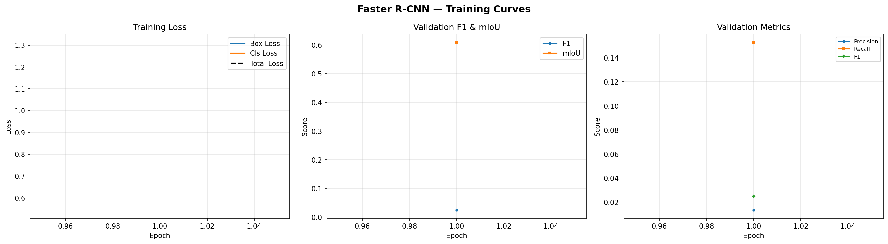 |
| SME-YOLO | 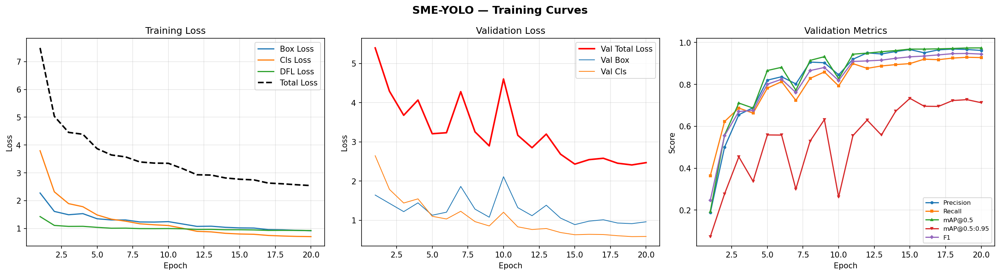 |
| YOLO26 | 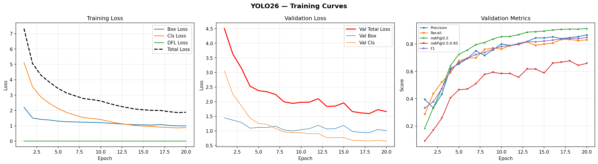 |
| ViT-Det | 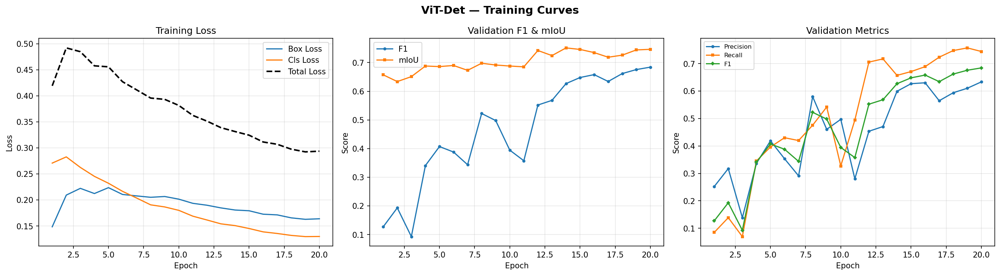 |
| RT-DETR | 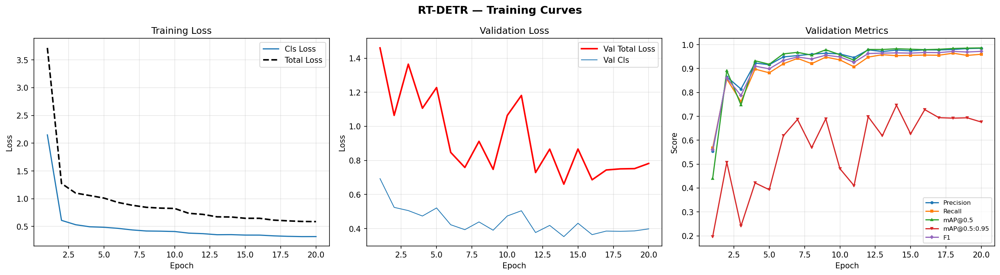 |

### 7.2 Comparison Overlay

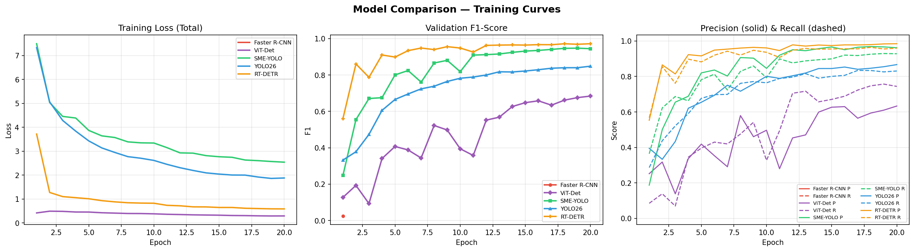

> Generated by `parse_logs.py`

---

## 8. Demo Predictions

Sample detection results on the test set:

| Faster R-CNN | SME-YOLO | YOLO26 |
|---|---|---|
| 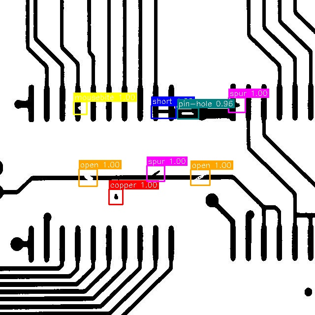 | 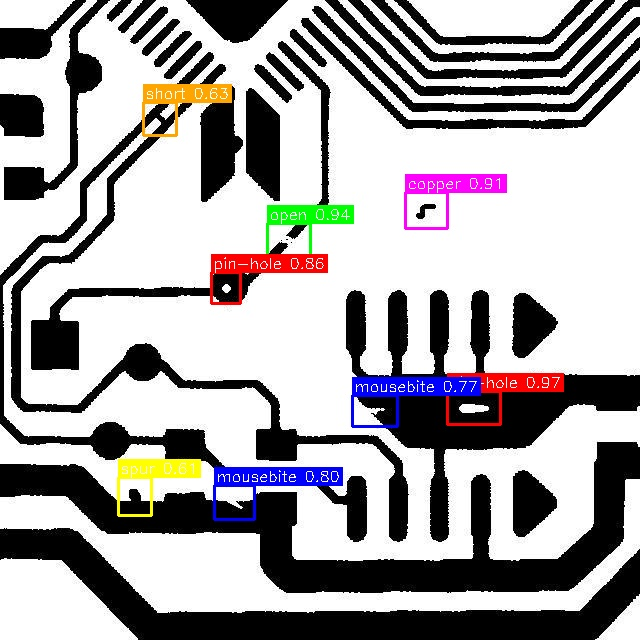 | 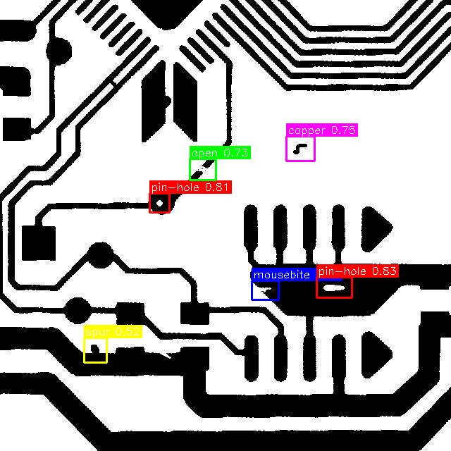 |
| 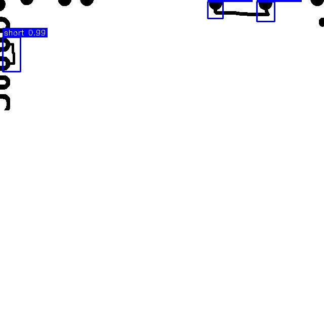 | 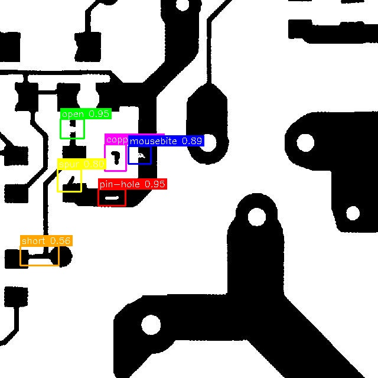 | 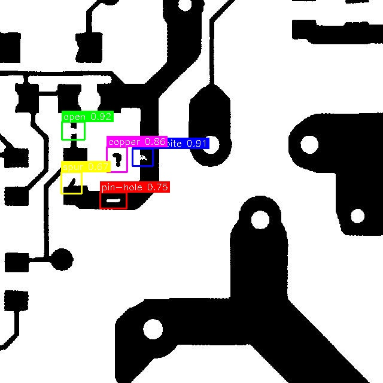 |

| ViT-Det | RT-DETR |
|---|---|
| 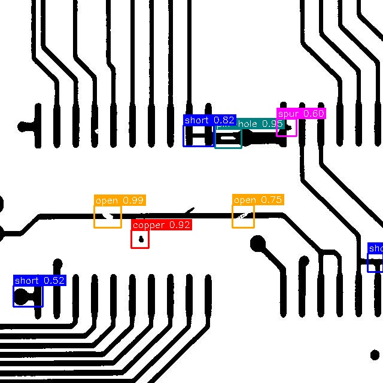 | 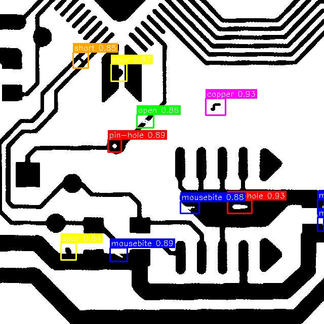 |
| 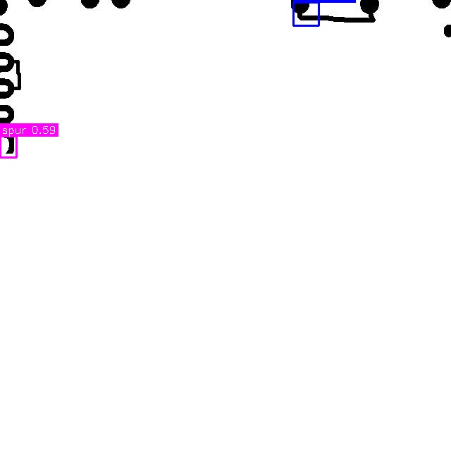 | 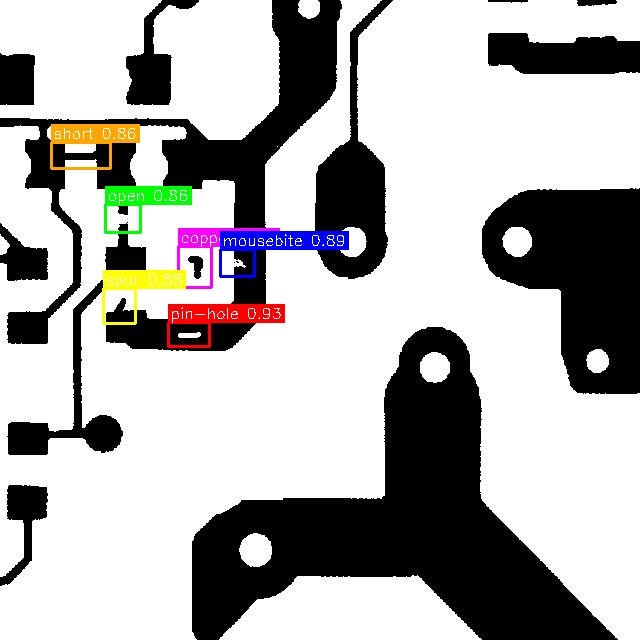 |

> Generated by `inference_demo.py`

---

## 9. Summary & Conclusions

| Criteria | Best Model | Notes |
|---|---|---|
| **Highest mAP@0.5** | {{BEST_MAP50_MODEL}} | {{BEST_MAP50_VALUE}} |
| **Fastest Inference** | {{FASTEST_MODEL}} | {{FASTEST_FPS}} FPS |
| **Smallest Model** | {{SMALLEST_MODEL}} | {{SMALLEST_SIZE}} MB |
| **Best F1-Score** | {{BEST_F1_MODEL}} | {{BEST_F1_VALUE}} |

### Key Findings

1. **{{PLACEHOLDER_FINDING_1}}**
2. **{{PLACEHOLDER_FINDING_2}}**
3. **{{PLACEHOLDER_FINDING_3}}**

---

## Appendix: How to Reproduce

```bash
# 1. Run inference demo (generates annotated images + speed benchmarks)
python inference_demo.py --models sme_yolo yolo26 faster_rcnn vit_det rt_detr

# 2. Parse training logs (generates plots + training time summary)
python parse_logs.py

# 3. Generate evaluation comparison table
python eval_compare.py

# 4. (Optional) Run fresh validation for Ultralytics models
python eval_compare.py --run_val
```

All outputs are saved to `results/` directory.
